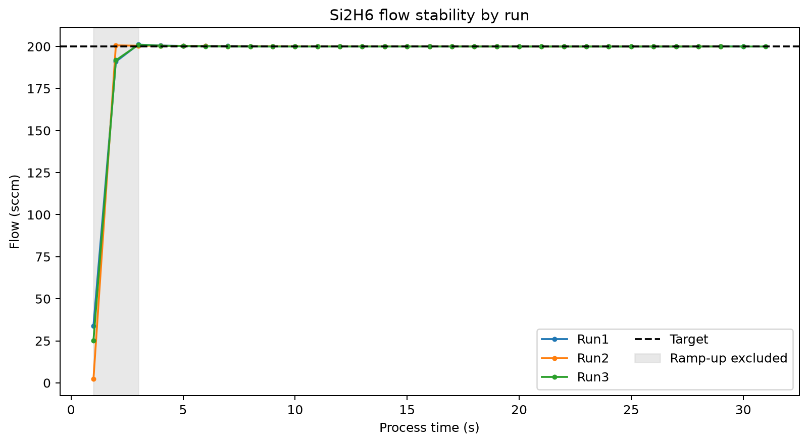
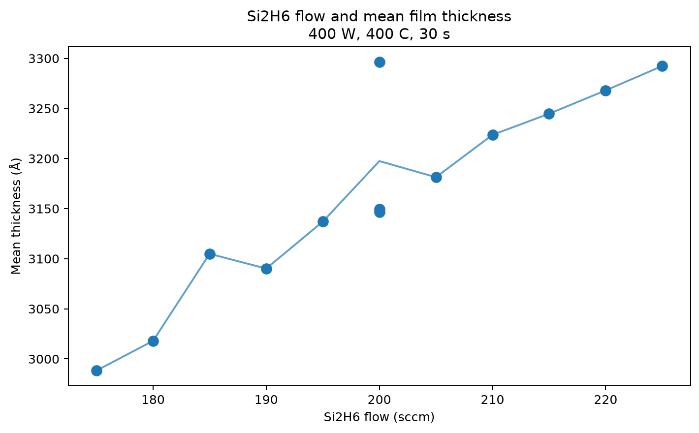
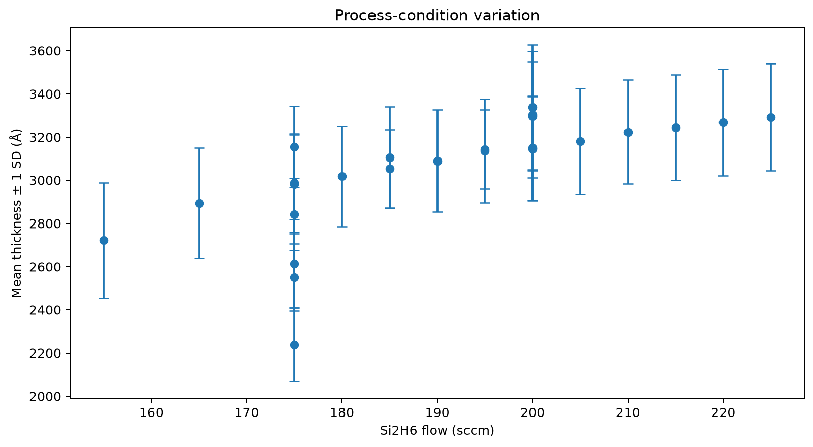
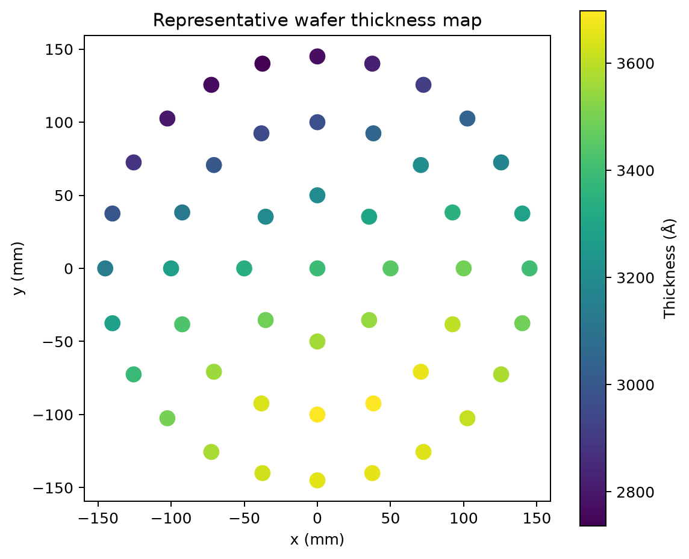

# Semiconductor Process Data Analysis

반도체 증착 공정 데이터를 정리하고, 센서 안정성과 공정조건별 박막 두께 변화를 분석한 프로젝트입니다. 공정 데이터를 기준에 맞게 전처리하고 통계량과 시각화를 통해 조건별 차이를 비교하는 데 초점을 두었습니다.

## Project overview

이 저장소는 두 가지 분석으로 구성됩니다.

1. **공정 센서 안정성 분석**: 세 번의 Run에서 측정한 Si2H6 유량을 비교하고, 초기 ramp-up 구간을 제외한 안정 구간의 평균과 표준편차를 계산했습니다.
2. **증착 공정조건 비교**: Si2H6 유량, RF power, 온도, 시간 조건에 따른 박막 두께의 평균과 산포를 비교하고 대표 wafer의 위치별 분포를 확인했습니다.

## 1. Process sensor stability



- 초기 3개 측정값을 ramp-up 구간으로 분리했습니다.
- 안정 구간의 평균 유량은 Run 1 `200.0693`, Run 2 `200.0496`, Run 3 `200.0111 sccm`이었습니다.
- 안정 구간의 표준편차는 각각 `0.1488`, `0.1194`, `0.1025 sccm`으로 계산됐습니다.
- 세 Run 모두 안정 구간 평균이 목표 유량 `200 sccm`에 근접했습니다.

평균 ± 3σ는 학습 데이터 내 Run 비교를 위한 경험적 범위로 사용했습니다. 검증된 생산 관리한계로 해석하지 않았습니다.

## 2. Deposition parameter analysis





- 총 25개 조건의 평균 두께, 최솟값, 최댓값, 범위와 표준편차를 비교했습니다.
- `400 W`, `400°C`, `30 s` 조건군에서 Si2H6 유량과 평균 두께는 양의 상관관계(`r = 0.904`)를 보였습니다.
- 전체 조건 중 가장 작은 표준편차는 `155.3101`이었으며, 해당 조건은 Si2H6 `175 sccm`, power `300 W`, 온도 `300°C`, 시간 `40 s`였습니다.
- 산포가 작다는 사실만으로 최적 조건이라고 결론내리지 않았습니다. 목표 두께와 규격을 함께 확인해야 합니다.

## 3. Representative wafer map



대표 조건의 49개 측정 위치를 좌표에 배치했습니다. 중심과 가장자리의 차이를 한눈에 확인하고, 이상 발생 시 우선 점검할 위치를 찾는 방식으로 활용할 수 있습니다.

## Repository structure

```text
analysis/  Reproducible Jupyter notebooks
data/      Aggregated educational sample data
images/    Analysis figures
src/       Source loading and calculation functions
tests/     Calculation, build, and privacy checks
```

## Run locally

```bash
pip install -r requirements.txt
jupyter notebook
```

`analysis` 폴더의 노트북을 위에서 아래로 실행하면 표와 그래프를 재현할 수 있습니다.

## Tools

- Python
- pandas, NumPy
- Matplotlib
- openpyxl
- Jupyter Notebook
- Excel

## Data and limitations

- 공개 데이터는 교육용 공정 데이터에서 재구성한 집계·샘플 데이터입니다.
- 분석 결과는 조건 간 관계를 보여주며 인과관계를 증명하지는 않습니다.
- 실제 양산 조건 선정에는 반복 실험, 측정시스템 검증, 설비 상태와 공식 규격 확인이 추가로 필요합니다.

## Relevance to process engineering

공정 데이터 전처리, 변수별 비교, 통계적 산포 확인, wafer 위치 기반 시각화 과정을 통해 데이터에 근거해 공정 상태를 판단하고 개선 후보를 좁히는 역량을 보여주는 프로젝트입니다.

