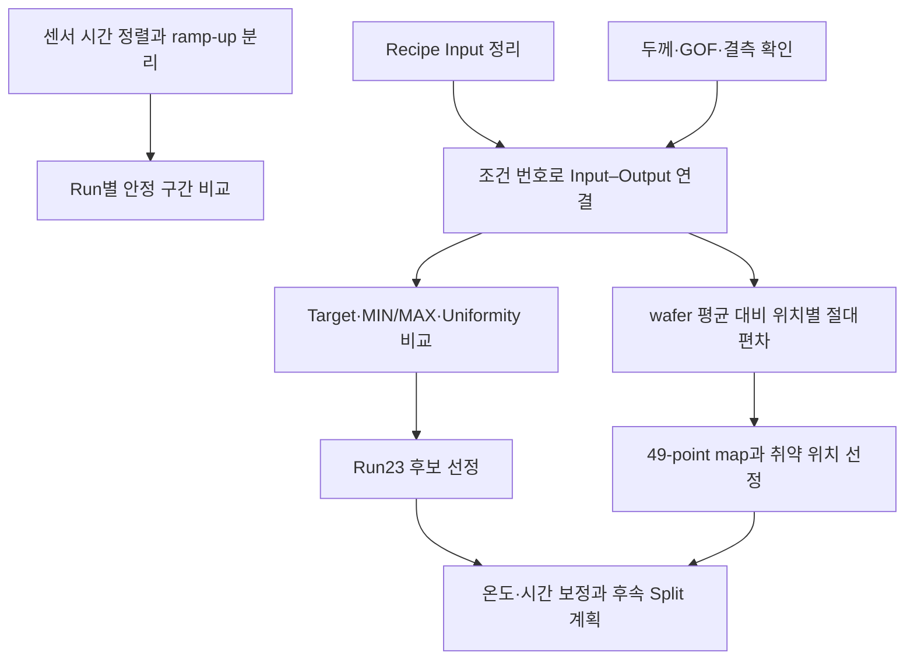
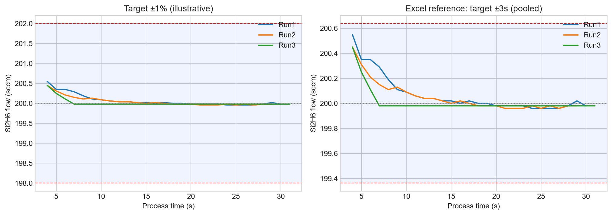
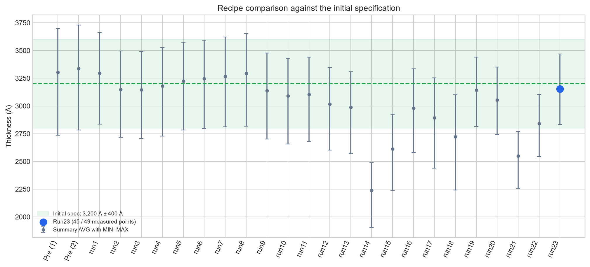
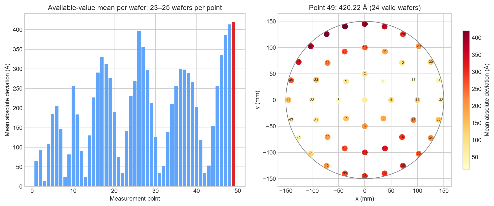
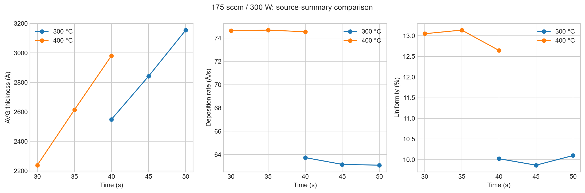

# Semiconductor Process Data Analysis

**센서 안정성 확인에서 Recipe–계측 데이터 연결, wafer 취약 위치 분석, 후속 Split 설계까지 수행한 반도체 증착 공정 데이터 분석 프로젝트입니다.**

Excel에서 직접 수행한 데이터 정리·계산·시각화를 바탕으로, 분석 순서와 판단 근거를 Python 코드와 공개용 집계 데이터로 정리했습니다. AI는 결과 해석을 보조하는 데 활용했습니다.

## 핵심 결과

| 분석 과제 | 수행 내용 | 결과 |
|---|---|---|
| 설비 센서 안정성 | 초기 ramp-up 분리, 3개 Run의 유량과 참고 범위 비교 | 안정 구간의 평균 유량이 200 sccm에 근접 |
| 조건별 두께 분석 | 25개 공정 실행의 Input–Output 연결, AVG·MIN·MAX·산포 비교 | 초기 **3,200 Å ± 400 Å** 기준에서 Run23을 우선 후보로 선정 |
| 위치별 취약성 | 각 wafer 평균 대비 절대편차를 49개 위치별로 집계 | **49번 위치 420.22 Å**, 유효 wafer 24개 기준 최대 |
| 후속 평가 설계 | 변경 **3,500 Å ± 300 Å** 기준으로 온도·시간 보정 | **234.7℃·55초**, 예상 AVG **3,481.20 Å**, 9개 Split 계획 |

Run23은 유효 측정 **45/49개 위치** 기준의 후보입니다. 후속 조건은 선형 가정에 따른 예측이며 실험 완료 결과가 아닙니다.

## 분석 흐름



## 1. 센서 전처리와 안정 구간 비교

시간축에 Run1·Run2·Run3을 맞추고 초기 과도 구간을 분리했습니다. 같은 유량 데이터에 목표값 ±1%와 엑셀의 표준편차 기반 참고 범위를 적용해 변동 수준을 확인했습니다.



엑셀의 두 번째 범위는 **목표값 200 ± 3×통합 표준편차**입니다. 공개 노트북의 **Run별 평균 ±3σ**와 계산 기준이 다르므로 따로 설명했습니다. [전처리와 센서 분석 상세](docs/01_preprocessing_and_matching.md)

## 2. 조건별 Target 적합성 비교

초기 Spec **3,200 Å ± 400 Å**에 대해 평균과 최솟값·최댓값을 함께 비교했습니다. 요약표 기준으로 관측 MIN–MAX가 규격 내인 Run19와 Run23 중 Target과 평균의 차이가 더 작은 Run23을 선정했습니다.



| 조건 | AVG (Å) | MIN (Å) | MAX (Å) | Target과 평균 차이 (Å) | Uniformity (%) |
|---|---:|---:|---:|---:|---:|
| Run19 | 3,143.88 | 2,815.92 | 3,439.55 | 56.12 | 9.92 |
| Run23 | 3,154.61 | 2,833.03 | 3,470.22 | 45.39 | 10.10 |

Run23의 4개 결측 위치는 재계측이 필요합니다. [조건 비교·선정 근거 상세](docs/02_condition_and_wafer_analysis.md)

## 3. Wafer 49-point 취약 위치 분석

각 측정값에서 해당 wafer의 평균을 뺀 **절대편차**를 계산하고, 같은 위치의 유효 wafer들에 대해 평균을 냈습니다. 결측값은 0으로 채우지 않았습니다.



49번은 평균 절대편차 **420.22 Å**, 48번은 **413.25 Å**였습니다. 두 위치를 포함한 외곽 영역을 우선 확인 대상으로 해석했습니다. 이 지표는 불량 확률이나 원인 확정을 의미하지 않습니다.

## 4. 변경 Spec을 위한 후속 실험 설계

**Uniformity 10% 이하**를 분석자가 정한 선별 기준으로 적용하고, 그중 평균 두께가 가장 큰 Run19를 기준점으로 삼았습니다. 기존 비교에서 확인한 온도 저하 경향을 이용해 균일도를 개선하고, 증착률 감소를 시간 증가로 보정하는 계획을 세웠습니다.



- 변경 목표: **3,500 Å ± 300 Å**
- 설계 참고 Uniformity: **8.57%** = 300 ÷ 3,500 × 100
- 계산 온도·시간: **234.72℃·55.30초**
- 평가 후보: **234.7℃·55초**, 예상 평균 **3,481.20 Å**
- 평가 계획: Si2H6 195 sccm 고정, Power·온도 3개 조합에서 시간 50·55·60초 비교

8.57%는 별도 요구 규격이 아닌 설계 참고값입니다. 모든 측정 위치의 두께가 3,200–3,800 Å에 들어오는지는 실제 MIN·MAX로 확인해야 합니다. [기준 조건·계산식·전체 Split 표](docs/03_follow_up_experiment.md)

## 데이터 검증과 해석 범위

- 현재 계측표에는 두께값 **9개 결측**이 있습니다. Run21의 5개 위치는 낮은 GOF와 겹치고, Run23에는 별도로 4개 결측이 있습니다.
- Run21 평균은 시트마다 차이가 있습니다. **원본 요약표 수치와 유효값 재계산 수치를 병기**하고, 위치별 분석은 유효값으로 wafer 평균을 다시 계산했습니다.
- Uniformity 정의는 **(MAX−MIN) / (2×AVG) × 100**이며, 작을수록 두께 범위가 상대적으로 좁습니다.
- Power·온도·시간 비교는 관찰 경향입니다. 통계적 유의성이나 양산 재현성은 검증하지 않았습니다.

[데이터 출처·수치 차이·재현 범위](docs/04_data_provenance.md) · [향후 분석 자동화 계획](docs/05_automation_roadmap.md)

## 실행 방법

저장소 루트에서 실행합니다. 공개 집계 CSV를 사용하므로 원본 Excel 없이 노트북과 그래프를 실행할 수 있습니다.

```bash
pip install -r requirements.txt
python -m src.render_detailed
python -m pytest -q
jupyter notebook
```

| 노트북 | 내용 |
|---|---|
| [01](analysis/01_process_sensor_stability.ipynb) | ramp-up 분리와 Run별 센서 통계 |
| [02](analysis/02_deposition_parameter_analysis.ipynb) | 고정 조건군 비교와 대표 wafer 두께 map |
| [03](analysis/03_quality_and_target_selection.ipynb) | 품질 확인·원본/재계산 차이·초기 규격 후보 선정 |
| [04](analysis/04_wafer_location_analysis.ipynb) | 위치별 절대편차 집계·유효 개수·취약 위치 map |
| [05](analysis/05_follow_up_experiment.ipynb) | Run19 선정·온도/시간 계산·9개 Split |

## 저장소 구성

```text
analysis/  단계별 실행 노트북
docs/      전처리·조건 선정·위치 분석·후속 평가 근거
data/      센서 샘플·조건 요약·위치별 집계·검증 표
images/    재생성 가능한 분석 그래프
src/       데이터 읽기·계산·시각화 함수
tests/     계산식·결측 처리·데이터 공개 항목 검증
```

**사용 도구:** Excel, Python, pandas, NumPy, Matplotlib, openpyxl, Jupyter Notebook

교육용 공정 데이터를 분석한 프로젝트입니다. 원본 Excel·PPT 전체와 개인정보는 포함하지 않았으며, 실제 공정 조건 적용에는 추가 평가가 필요합니다.
